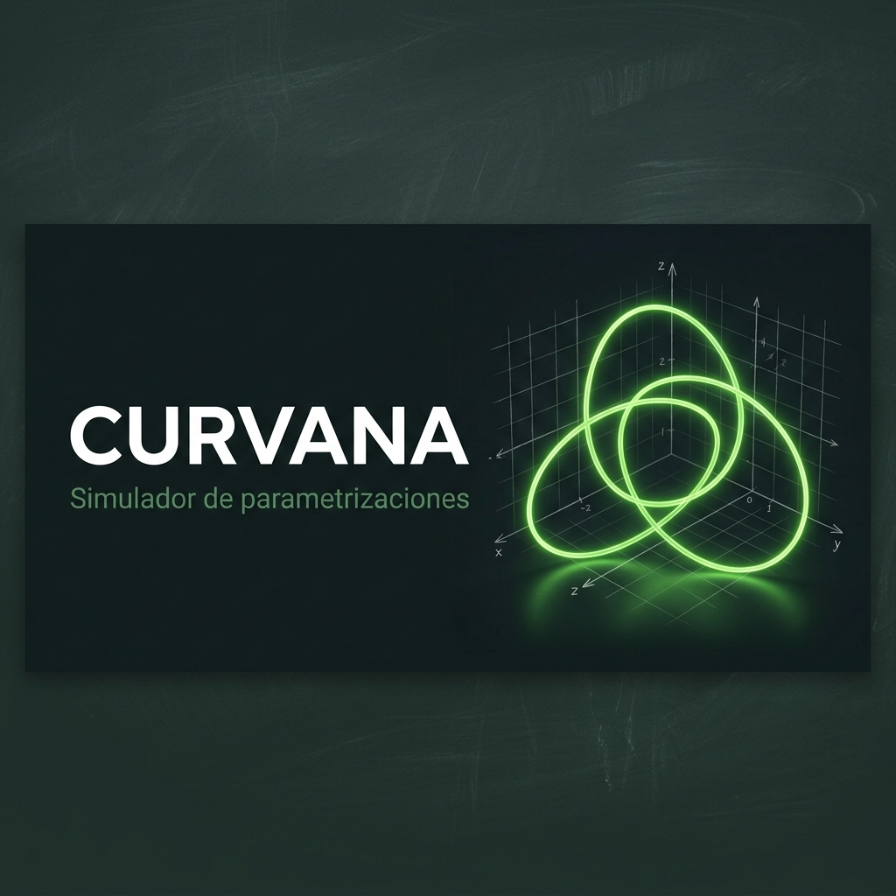
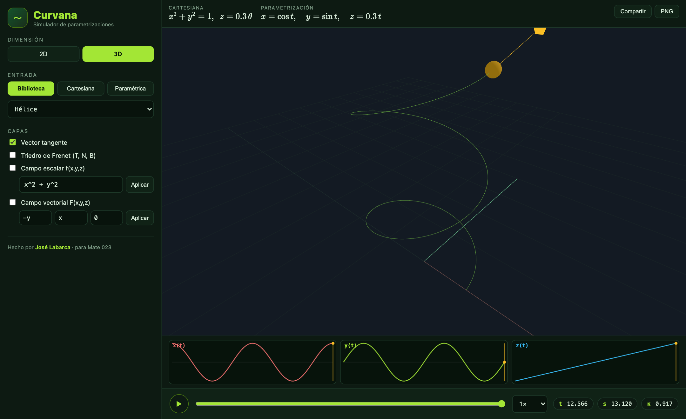

<p align="right"><a href="README.md">🇪🇸 Español</a> · <b>🇬🇧 English</b></p>

<p align="center">
  
</p>

# Curvana

**Interactive simulator of 2D and 3D curve parametrizations** for multivariable Calculus III.



Type a curve (Cartesian, parametric, or from a library), watch the parameter `t` **build** it as you
move a slider, and connect it to the core topics of the course: **line integrals** over scalar and
vector fields, and the **differential analysis** of the curve (Frenet frame, curvature, and arc length).

> Made by **José Labarca** · to teach how to parametrize functions and curves in Calculus III.

---

## ✨ Features

- **Three input modes (hybrid model):**
  - **Library** of standard curves (line, circle, ellipse, parabola, helix, spiral, Lissajous,
    conical spiral, Viviani's curve).
  - **Cartesian**: type the equation and Curvana **derives the parametrization** (circles, ellipses,
    parabolas, lines, `y = f(x)`, and 3D intersections such as cylinder ∩ plane).
  - **Parametric**: type `x(t)`, `y(t)`, `z(t)` and the range of `t`.
- **OCR**: upload a **photo or screenshot** of an equation and its text is recognized so you can edit
  and plot it (Tesseract.js, in the browser).
- **Slider animation**: the curve is traced progressively as `t` advances, with play/pause and speed.
- **Component mini-plots** `x(t)`, `y(t)`, `z(t)`: show how each coordinate builds the curve.
- **Differential analysis**: tangent vector, Frenet frame (T, N, B), curvature `κ`, and arc length `s`.
- **Fields**: overlay a **scalar field** (colors the curve) and a **vector field** (arrows), with the
  **line integral** `∫f ds` and `∫F·dr` accumulating live.
- **Share via link**: the state is serialized in the URL. **Export PNG** of the viewport.
- **2D** and **3D** modes, LaTeX equations (KaTeX), green "chalkboard" theme.

## 🏗️ Architecture

Strict separation between the **engine** and the **interface**:

```
src/
  core/        # PURE math engine (no DOM, no Three.js) — 100% testable
    vector, parser, curve, differential, integrate, fields, library, cartesian, state
  render/      # Three.js: scene, curve, Frenet frame, vector field
  ui/          # DOM: control panel, mini-plots, transport bar, equations
  services/ocr # OCR behind the OcrProvider interface (Tesseract by default)
  app.ts       # Orchestrates UI ↔ core ↔ render
```

Dependency rule: `ui/` and `render/` depend on `core/`, **never the other way around**. The UI only
**represents** what the core computes.

## 🚀 Development

Requires Node 20+.

```bash
npm install
npm run dev      # development server (http://localhost:5173)
npm test         # math core tests (Vitest)
npm run build    # production build to dist/
npm run preview  # preview the build
```

## 🌐 Deploy to GitHub Pages

The repository includes a workflow (`.github/workflows/deploy.yml`) that runs the tests, builds, and
publishes `dist/` to GitHub Pages on every push to `main`. 

## 🖥️ Desktop apps (Mac / Windows / Linux)

Curvana is also packaged as a native app with **Electron**.

```bash
npm run app        # run the desktop app locally
npm run dist       # build the installer for YOUR operating system (in release/)
npm run dist:mac   # .dmg + .zip  (macOS only)
npm run dist:win   # .exe (NSIS) + portable  (Windows only)
npm run dist:linux # .AppImage + .deb  (Linux only)
```

Each installer must be built on its own operating system. To produce all **three at once**, the
repository includes the `.github/workflows/package.yml` workflow, which builds on GitHub's native
runners (macOS, Windows, and Ubuntu) when you push a `v*` tag (or manually from the Actions tab):

```bash
git tag v0.1.0 && git push --tags   # triggers packaging on all three systems
```

The installers are kept as workflow artifacts and, on tags, attached to a GitHub Release.

## 🧪 Correctness

The math core is covered by tests that compare against known results: curvature of the helix and the
circle, arc length (`2πr`), orthonormality of the Frenet frame, the integral of a conservative field
(`Δφ`), `∮(-y\,dx + x\,dy) = 2·area`, and identification of each Cartesian family.

## 🧰 Stack

Vite · TypeScript · Three.js · math.js · KaTeX · Tesseract.js · Vitest.

## 📄 License

MIT © 2026 **José Labarca**.
